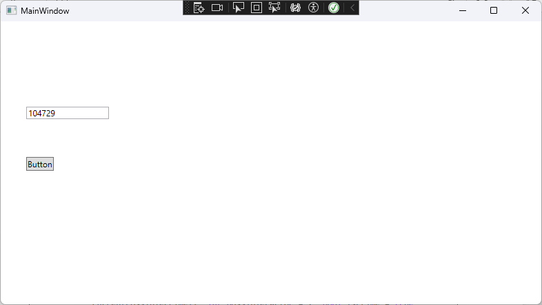

# Distributed Systems: Threads

[← Lab 2 ](lab-2.md) | [← Back to Main README](README.md) | [Next: Lab 4 →](lab-4.md)

## SMART Objectives

ADD OBJECTIVES OF THE LAB HERE

## Completed Tasks

this is how it looks with single threading it is quite slow to calculate
## Reflection

ADD REFLECTION OF THE LAB HERE

**Navigation:**

* [Main README](README.md)
* [Lab 2](lab-2.md)
* [Lab 4](lab-4.md)
